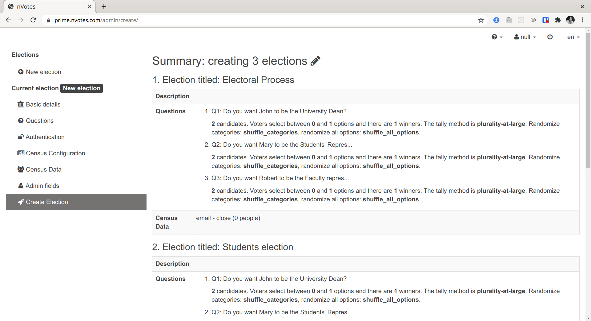
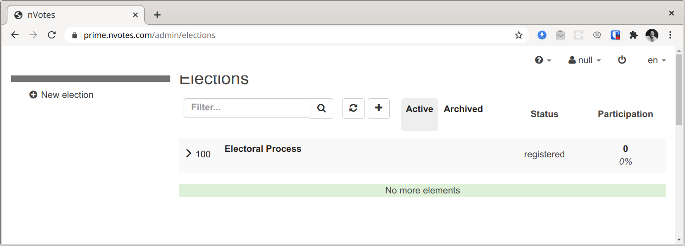
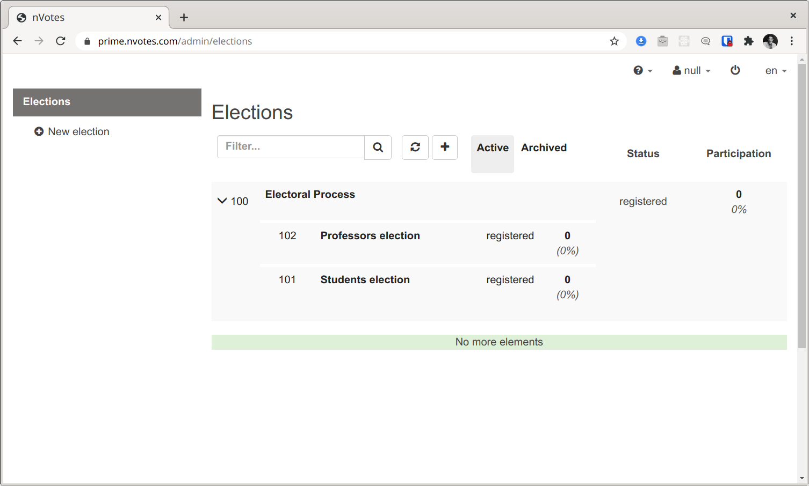

In this document we will review how to create parent and children elections 
and what are their characteristics.

Sometimes it's required in advanced elections to have some common questions
available for all the electorate, and some other questions available to only
some of them. For the common questions you might want to have a tally from
each of these districts, and also a consolidated tally with all of them.

## Virtual vs Parent elections

:::info Enabling Virtual Elections
Virtual elections are not enabled by default because for security reasons 
virtual elections should not be enabled in multi-tenant deployments, as 
`agora-elections` do not verify that the election creator has permissions for
accessing the sub-elections.
:::

There are two different possible types of relations between 
elections:
1. A [virtual election](election-creation.md#election-virtual) and its respective 
[virtual subelections](election-creation.md#election-virtualSubelections).
2. A [parent election](election-creation.md#election-parent_id) and its respective 
[children elections](election-creation.md#election-children_election_info).

The first kind of relation (virtual elections and virtual subelections) is 
established in `agora-elections`, and its use is allows for electoral results
consolidation.

The second kind of relation is established in `authapi` and its use is more
related to the authentication, authorization and presentation behaviour in the
earlier stages of an election, for example during login.

Both are closely related/coupled, because usually you want to do both or none. 
The separation exists simply because `authapi` and `agora-elections` are
different modules that have separated databases.

## Parent and children elections

When a set of election have a parent-children relationship, they have the 
following behaviour:
1. In the Admin election list, the children elections are hidden by default and
only shown as a dropdown of the parent election.
2. In the Admin election dashboard, the parent election can manage the children
elections. For example starting or stopping the parent election starts/stops 
the children elections automatically. The parent election dashboard also allows
to trigger the tally of specific subelections with a chooser widget, and also
allows to switch to see the election results of specific children elections.
3. In the Admin election Census Data, you can assign to each voter a subset of 
the children elections, to allow a specific subset of children elections. The
Census Data section also allows you to view in which children elections has any
voter voted.
4. In the parent election results public website, there's a chooser widget to
choose which children election results to visualize.
5. In the voting booth, after authentication the voter will vote without having
to authenticate again in  the assigned children election in their 
[natural order](election-creation.md#child-election-natural_order) sequentially. 
If a voter does  not vote to all the children elections assigned to this voter, 
then he will be able to authenticate again and vote in the next unvoted 
children election.

## University elections example

Apart from the brief description above, we recommend you delve in to the details
of election creation reading the 
[election creation documentation](election-creation.md) for reference 
documentation.

In this tutorial we are going to create an university electoral process 
compromised of 3 different elections. The electoral process contains 3 Yes/No 
questions:

1. **For Everyone**: Q1: Do you want John to be the University Dean?
2. **For Students**: Q2: Do you want Mary to be the Students' Representative?
2. **For Professors**: Q3: Do you want Robert to be the Faculty representative?


To replicate this, we can use parent and children elections. We would have
something like this:


In the graphic above the question indexes within each election is indicated 
between brackets like `[0]`.

To do so, we will create the elections as described in 
[Election Creation Guide](election-creation.md). The
[Election JSON settings](election-creation.md#election-json-settings) will be
similar to the following sketch:

```json
[
  {
    "id": 100, // election id
    "title": "Electoral Process",
    "children_election_info": {
      "natural_order": [101, 102],
      "presentation": {
        "categories": [
          {
            "events": [
              {"event_id": 101, "title": "Students"},
              {"event_id": 102, "title": "Professors"}
            ],
            "id": 1,
            "title": "Sectors"
          }
        ]
      }
    },
    "questions": [
      {
        "title": "Q1: Do you want John to be the University Dean?",
        "answers": [
          {"id": 0, "text": "Yes"},
          {"id": 1, "text": "No"}
        ]
      },
      {
        "title": "Q2: Do you want Mary to be the Students' Representative?",
        "answers": [
          {"id": 0, "text": "Yes"},
          {"id": 1, "text": "No"}
        ]
      },
      {
        "title": "Q3: Do you want Robert to be the Faculty representative?",
        "answers": [
          {"id": 0, "text": "Yes"},
          {"id": 1, "text": "No"}
        ]
      },
    ],
    // ..other election properties for election with id=100 missing here..
  },
  {
    "id": 101, // election id
    "title": "Students election",
    "parent_id": 100,
    "questions": [
      {
        "title": "Q1: Do you want John to be the University Dean?",
        "answers": [
          {"id": 0, "text": "Yes"},
          {"id": 1, "text": "No"}
        ]
      },
      {
        "title": "Q2: Do you want Mary to be the Students' Representative?",
        "answers": [
          {"id": 0, "text": "Yes"},
          {"id": 1, "text": "No"}
        ]
      }
    ],
    // ..other election properties for election with id=101 missing here..
  },
  {
    "id": 102, // election id
    "title": "Professors election",
    "parent_id": 100,
    "questions": [
      {
        "title": "Q1: Do you want John to be the University Dean?",
        "answers": [
          {"id": 0, "text": "Yes"},
          {"id": 1, "text": "No"}
        ]
      },
      {
        "title": "Q3: Do you want Robert to be the Faculty representative?",
        "answers": [
          {"id": 0, "text": "Yes"},
          {"id": 1, "text": "No"}
        ]
      }
    ],
    // ..other election properties for election with id=102 missing here..
  }
]
```
:::note
There are many missing properties in the configuration above. The sketched  
document is just part of the complete JSON document and if you try to create the
[Election Creation Guide](election-creation.md#creating-elections) it will fail.
In the document above we are just showing the parts of the JSON document that 
we want to explain at this moment. You can access the 
[final document, complete and with some modifications here](./assets/university_example.yaml).
The modifications will be improvements / evolutions that we will be explaining 
in this document. It is that final document that we will use later to create
the elections.
:::

The sketched JSON document above is the configuration regarding the questions 
and the  parent-children relations. See 
[children_election_info](election-creation.md#election-children_election_info)
for details.

The questions set in the parent election (with `id=100`) are not used for much 
because voters will only vote in the children elections. For results 
consolidation in the parent election we could just use the appropiate
[Results Config Pipes](election-creation.md#results-config-pipes) to clone the 
election from the subelections. We will do something similar later on. However, 
note that it's required for all elections to be created with at least one 
question - parent election included.

What follows is the same JSON configuration as before, but this time we only 
sketched the information regarding the virtual elections and 
[results config pipes](election-creation.md#results-config-pipes):

```json
[
  {
    "id": 100, // election id
    "virtual": true,
    "virtualSubelections": [101, 102],
    "resultsConfig": [
      [
        // We source votes from source subelection questions to the 
        // appropiate virtual election questions.
        "agora_results.pipes.multipart.multipart_tally_plaintexts_append_joiner",
        {
          "mappings": [
            {
              // From: Students Election #101 | Q1
              "source_election_id": 1,
              "source_question_num": 0,
              // To: Electoral Process #100 | Q1
              "dst_election_id": 0,
              "dst_question_num": 0
            },
            {
              // From: Professors Election #102 | Q1
              "source_election_id": 2,
              "source_question_num": 0,
              // To: Electoral Process #100 | Q1
              "dst_election_id": 0,
              "dst_question_num": 0
            },
            {
              // From: Students Election #101 | Q2
              "source_election_id": 1,
              "source_question_num": 1,
              // To: Electoral Process #100 | Q2
              "dst_election_id": 0,
              "dst_question_num": 1
            },
            {
              // From: Professors Election #102 | Q3
              "source_election_id": 2,
              "source_question_num": 1,
              // To: Electoral Process #100 | Q3
              "dst_election_id": 0,
              "dst_question_num": 2
            }
          ]
        }
      ],
      ["agora_results.pipes.results.do_tallies", {}],
      ["agora_results.pipes.sort.sort_non_iterative", {}]
    ]
    // ..other election properties for election with id=100 missing here..
  },
  {
    "id": 101,
    "resultsConfig": [
      ["agora_results.pipes.results.do_tallies", {}],
      ["agora_results.pipes.sort.sort_non_iterative", {}]
    ]
    // ..other election properties for election with id=101 missing here..
  },
  {
    "id": 102,
    "resultsConfig": [
      ["agora_results.pipes.results.do_tallies", {}],
      ["agora_results.pipes.sort.sort_non_iterative", {}]
    ]
    // ..other election properties for election with id=102 missing here..
  },
]
```

The juice of this part is in the `resultsConfig` for the virtual election 
(`id=100`). As `agora-results` doesn't know the id of the subelections, it 
references to the subelections by array index. The virtual election (with 
`id=100`) has always array index `0`. Then the sub-elections are indexed in the  
order of appeareance in the `virtualSubelections` property. Thus, within 
`agora-results` the indexes of elections transform this way:

- Electoral Process #100 => Election Index 0
- Students Election #101 => Election Index 1
- Professors Election #102 => Election Index 2

We are using the `multipart_tally_plaintexts_append_joiner` pipe to source 
ballots from the subelections to the virtual election for results consolidation.

We would want three different versions of the results for Q1:
1. Q1 Consolidated results of both students and professors.
2. Q1 Results from students.
3. Q1 Results from professors.

The consolidated results for Q1 will appear in the election with `id=100`. That 
election will also show the results for Q2 and Q3 because we ensured to source 
ballots for those questions from the sub-elections in which the students and 
professors voted.

We could further improve the election with `id=100` election results to contain 
there all the electoral information and not just consolidated elections. We could
clone twice Q1 and adjust the title of the cloned questions to do something 
like:

 

The configuration file sketch would be:

```json
[
  {
    "id": 100,
    "virtual": true,
    "virtualSubelections": [101, 102],
    "resultsConfig": [
      [
        // We duplicate Q1 in election with array index 0 (Electoral Process 
        // #100) into question indexes 1 and 2 for students and professors, 
        // with empty ballots as votes will be sourced later with the 
        // multipart_tally_plaintexts_append_joiner pipe.
        "agora_results.pipes.duplicate_questions.duplicate_questions",
        {
          "duplications": [
            {
              "source_election_index": 0,
              "base_question_index": 0,
              "duplicated_question_indexes": [1, 2],
              "zero_plaintexts": true
            }
          ]
        }
      ],

      [
        "agora_results.pipes.modifications.apply_modifications",
        {
          "modifications": [
            {
              "action": "set-title",
              "question_index": 0,
              "title": "Q1 all: Do you want John to be the University Dean?"
            },
            {
              "action": "set-title",
              "question_index": 1,
              "title": "Q1 students: Do you want John to be the University Dean?"
            },
            {
              "action": "set-title",
              "question_index": 2,
              "title": "Q1 professors: Do you want John to be the University Dean?"
            }
          ]
        }
      ],
      [
        // We source votes from source subelection questions to the
        // appropiate virtual election questions.
        "agora_results.pipes.multipart.multipart_tally_plaintexts_append_joiner",
        {
          "mappings": [
            {
              // From: Students Election #101 | Q1
              "source_election_id": 1,
              "source_question_num": 0,
              // To: Electoral Process #100 | Q1 all
              "dst_election_id": 0,
              "dst_question_num": 0
            },
            {
              // From: Students Election #101 | Q1
              "source_election_id": 1,
              "source_question_num": 0,
              // To: Electoral Process #100 | Q1 students
              "dst_election_id": 0,
              "dst_question_num": 1
            },
            {
              // From: Professors Election #102 | Q1
              "source_election_id": 2,
              "source_question_num": 0,
              // To: Electoral Process #100 | Q1 all
              "dst_election_id": 0,
              "dst_question_num": 0
            },
            {
              // From: Professors Election #102 | Q1
              "source_election_id": 2,
              "source_question_num": 0,
              // To: Electoral Process #100 | Q1 professors
              "dst_election_id": 0,
              "dst_question_num": 2
            },
            {
              // From: Students Election #101 | Q2
              "source_election_id": 1,
              "source_question_num": 1,
              // To: Electoral Process #100 | Q2
              "dst_election_id": 0,
              "dst_question_num": 3
            },
            {
              // From: Professors Election #102 | Q3
              "source_election_id": 2,
              "source_question_num": 1,
              // To: Electoral Process #100 | Q3
              "dst_election_id": 0,
              "dst_question_num": 4
            }
          ]
        }
      ],
      ["agora_results.pipes.results.do_tallies", {}],
      ["agora_results.pipes.sort.sort_non_iterative", {}]
    ]
    // ..other election properties for election with id=100 missing here..
  },
  {
    "id": 101,
    "resultsConfig": [
      ["agora_results.pipes.results.do_tallies", {}],
      ["agora_results.pipes.sort.sort_non_iterative", {}]
    ]
    // ..other election properties for election with id=101 missing here..
  },
  {
    "id": 102,
    "resultsConfig": [
      ["agora_results.pipes.results.do_tallies", {}],
      ["agora_results.pipes.sort.sort_non_iterative", {}]
    ]
    // ..other election properties for election with id=102 missing here..
  },
]
```

:::note
In a powerful system such as the Agora Voting project, sometimes there are 
multiple ways to do the same thing. That is the case with this last results 
pipes configuration for election with id=1 in this last example. It is more 
complicated than needed in this case. This is done just for demonstration 
purposes, to demonstrate you what kind of things you can do with the agora 
results pipe system and to demonstrate that the questions shown in the 
election results don't need to be the same as the original election question 
list.

Instead of duplicating `Q1` twice for election with `id=100` and then changing
those three question titles adding the prefix `Q1 all`, `Q1 students` and 
`Q1 professors`, we could have just applied those changes directly in the list
of original questions for the election with `id=100`. Of course, to obtain the
same election results you would still have to apply the same 
`multipart_tally_plaintexts_append_joiner` pipe that sources the ballots from
the right children election questions into the pertinent parent election 
questions.

We leave to the reader the task of modifying the JSON document of the elections
to apply those changes as an exercise.
:::

### Adding census on election creation

As described in 
[the census API](election-creation.md#assigning-children-elections-in-parent-election-census)
you can set the census for the parent election to specify in which children 
elections can a voter vote. 

Let's add a couple students and one professor in our example json config sketch:

```json
[
  {
    "id": 100,
    // ..other election properties for election with id=100 missing here..
    "census": {
      "voters": [
        {
          "metadata": {
            "email": "student1@example.com",
            "children_event_id_list": [101]
          }
        },
        {
          "metadata": {
            "email": "student2@example.com",
            "children_event_id_list": [101]
          }
        },
        {
          "metadata": {
            "email": "professor1@example.com",
            "children_event_id_list": [102]
          }
        },
      ],
      "extra_fields": [],
      "admin_fields": [],
      "has_ballot_boxes": false,
      "auth_method": "email",
      "census": "close"
    }
  },
  {
    "id": 101
    // ..other election properties for election with id=101 missing here..
  },
  {
    "id": 102
    // ..other election properties for election with id=102 missing here..
  }
]
```


## Create and manage the elections

The complete elections JSON configuration of our university elections example 
can be found in the 
[university_example.json](./assets/university_example.yaml) file.

:::note election cannot be created?
If you have already not only registered but created any election with ids `100`,
`101` or `102`, you will have to modify the ids (and all its references) to use
other election ids. [More details here](election-creation.md#modifying-elections).

Also, please note that you will need to modify the example to correctly name
the election authorities in your deployment. We are using `test-a1` and 
`test-a2` in the [university_example.json](./assets/university_example.yaml), 
but you might need to change that.
:::

Please read and follow the 
[guide on how to create the elections](election-creation.md) to do so. When you
reach to the step of editing the elections JSON, after applying the content of
the [university_example.json](./assets/university_example.yaml), you will see
the following screen:



If you scroll down and click in `Create the elections`, they will be created.
Afterwards, the interface will redirect you to the dashboard of the first
election created, the parent election with `id=100`:


If you go back to the election list (clicking in the sidebar menu item 
`Elections`), you will notice that only the parent election is listed:



However, you will see that this election has a left notch `>`. If you click 
there, you will see the expanded list of children elections related to this
parent election:



If you click in the Parent Election (`id=100`), then go to the `Census Data`
section and then click in `Actions` button and in the `Add person..` menu item,
you will see the following dialog:


Voters can only authenticate in parent elections - they won't be able to 
directly authenticate in the children election. And you should work the census
in the parent elections only too. 

When you add the census to the parent election, something you can do either 
directly [during election creation](election-creation.md#census-config-object) 
or afterwards using the actions in the `Census Data` section, you will be able 
to assign voters to children elections in which they will be able to vote. 

We'll register our census using the actions in `Census Data`. Lets register a 
student, so we will only to let this voter in the `Students Election`:


Once confirmed and added to the census, you will be able to see the column that
marks in which children elections can this voter participate:


